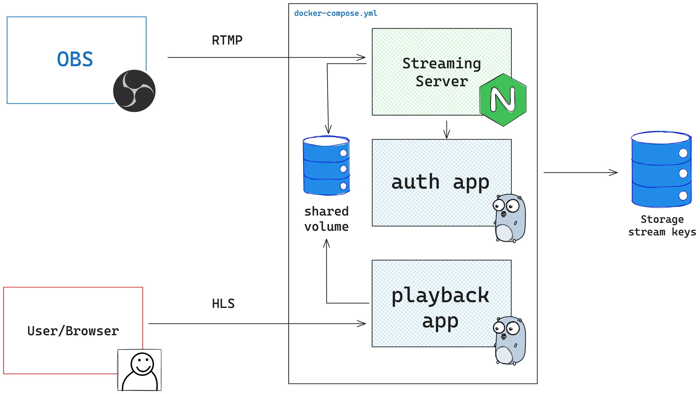

# Introdução

Em uma plataforma de streaming ao vivo como youtube, twitch, meta, tiktok existe um protocolo chamado RTMP que eu já cheguei a falar dele em outros vídeos, você pode clicar aqui para ver. Cheguei a fazer um vídeo aqui no canal no qual criamos um servidor de live streaming com NGINX simples, sem autenticação e nenhum outro requisito.

